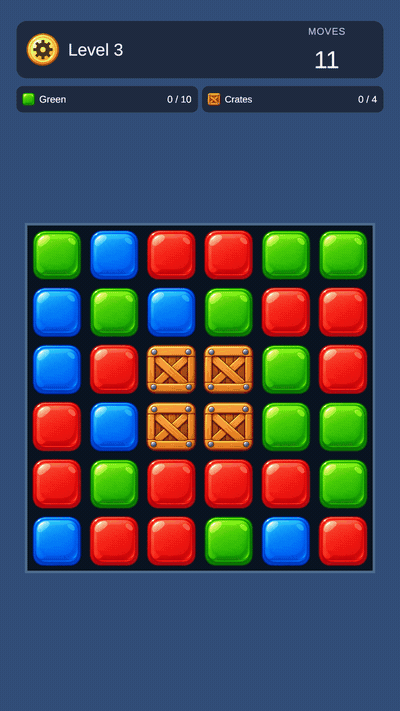
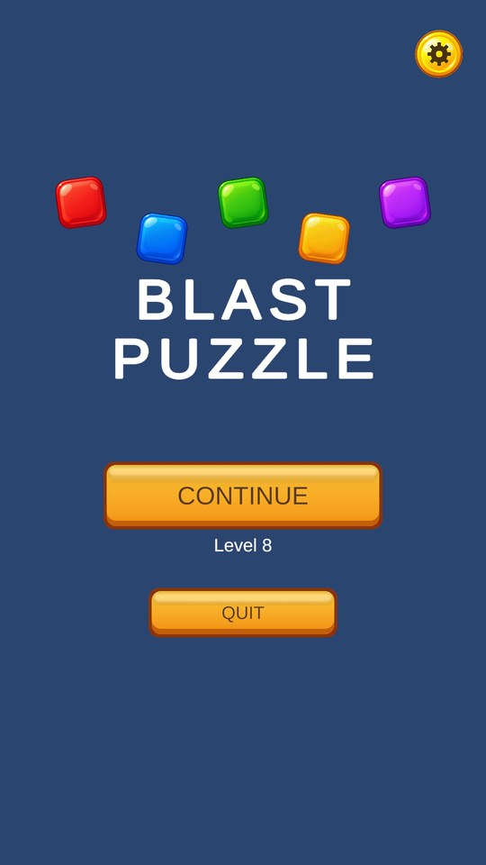
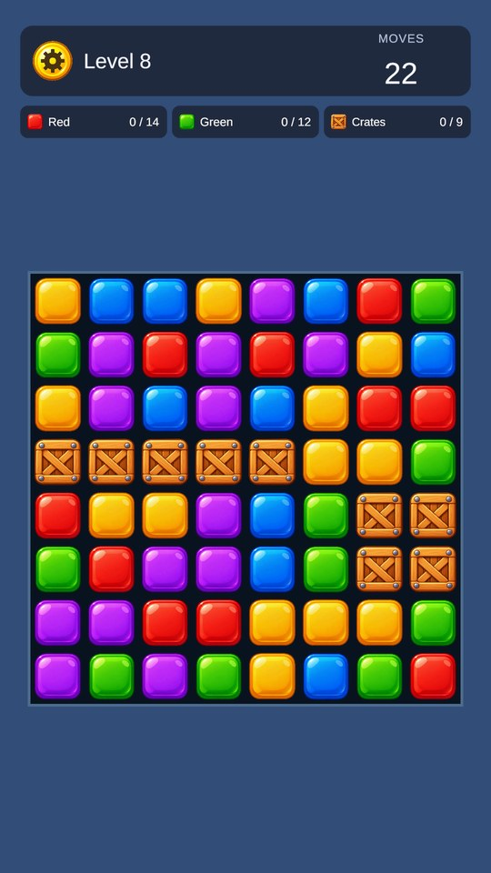
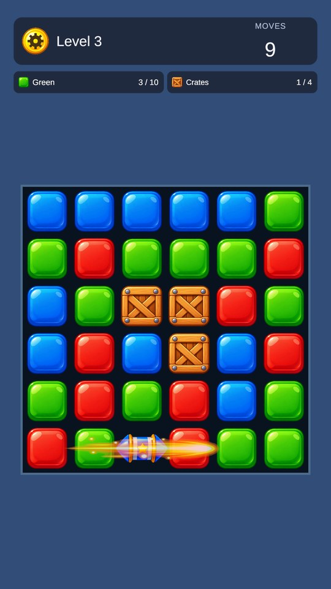
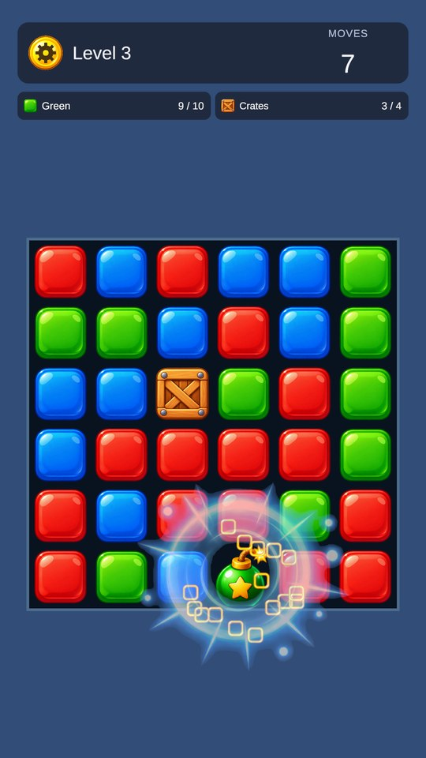
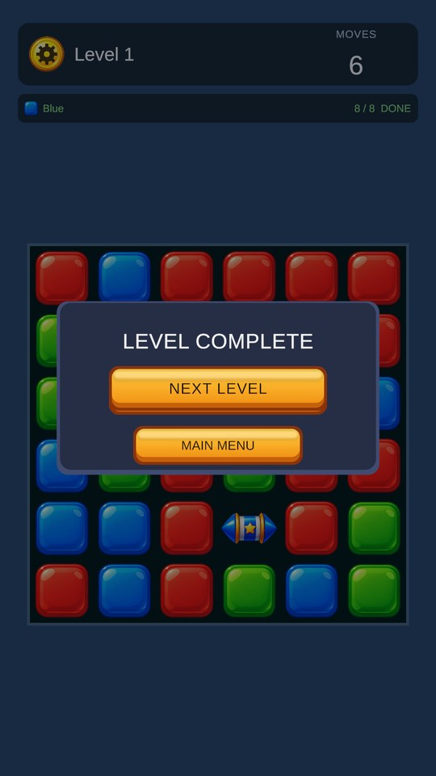
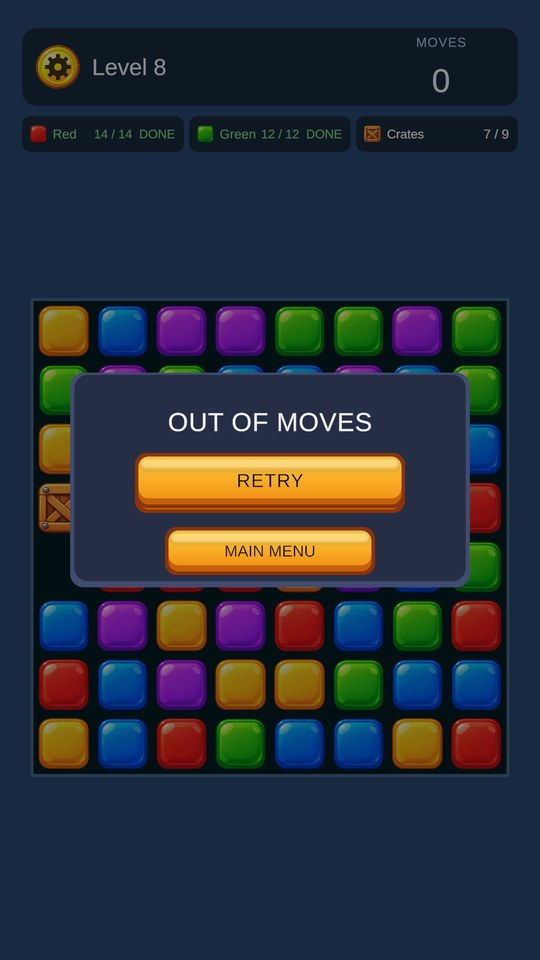
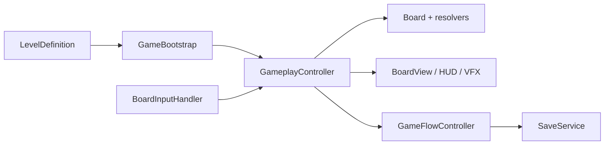
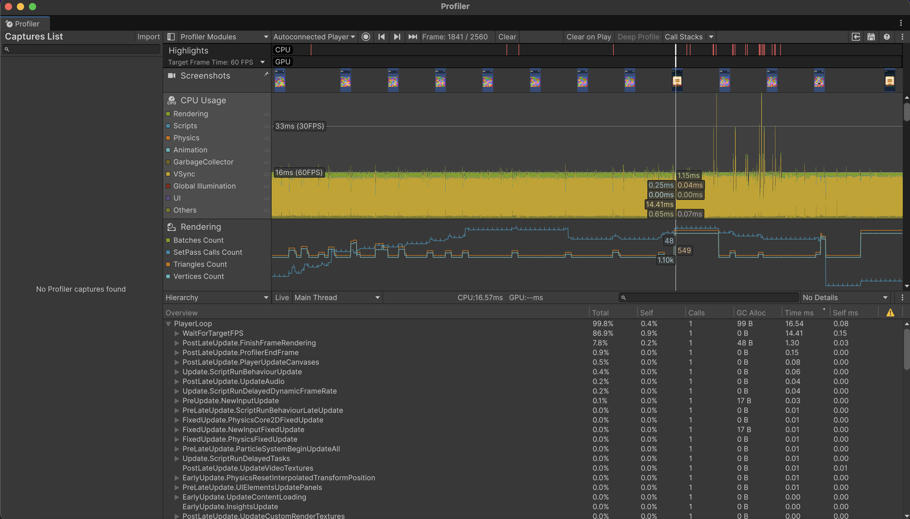

# BlastPuzzle



A portrait mobile 2D tap-to-blast puzzle game built in Unity 6 and C#. Players remove orthogonally connected groups of same-coloured blocks, complete level goals, break Crates and use Rocket and Bomb power-ups within a limited number of moves. There are ten handcrafted levels, a main menu and saved progression.

The engineering focus is:

- a deterministic board simulation written in plain C#, separate from Unity presentation code;
- data-driven levels authored as ScriptableObjects;
- 122 automated EditMode and PlayMode tests;
- pooled block views and Unity Profiler measurements, in the Editor and on an iPhone 15.

This is a portfolio-scale project, not a shipped product.

<br clear="right">

## Gameplay

1. Tap a block. If it belongs to an orthogonally connected group of **2 or more** normal blocks of the same colour, the whole group is removed and one move is spent. Smaller groups shake and cost nothing.
2. Groups of **5–6** leave a **Rocket** on the tapped cell. The Rocket is horizontal if the group was at least as wide as it was tall, vertical otherwise. Groups of **7+** leave a **Bomb**.
3. Tapping a power-up costs one move:
   - A Rocket clears its whole row or column.
   - A Bomb clears the 3×3 square around it, diagonals included.
   - A power-up caught in another blast fires too, as a chain reaction. Each power-up fires at most once per move.
4. **Crates** are single-hit obstacles. A group blast breaks crates next to the removed cells; power-ups break crates in their footprint. Crates never fall, so gravity treats them as walls.
5. **Gravity** has two steps. First, blocks fall straight down within the column segments between crates. Then blocks can slide one step diagonally into gaps under crates. Open columns refill from the top. A pocket completely enclosed by crates stays empty until a later move opens a way in.
6. After everything settles, the level ends: **won** when every colour and crate goal is complete, **lost** when no moves remain. Otherwise play continues. If no valid move exists, the board is shuffled without spending a move. If a bounded shuffle cannot find a playable layout, the player is offered a retry.

| Menu | 8×8 board | Rocket | Bomb | Win | Loss |
| --- | --- | --- | --- | --- | --- |
|  |  |  |  |  |  |

*The GIF and screenshots were captured in Unity Editor Play Mode at 1080×1920.*

## Features

- Tap-to-blast with BFS group detection, vertical and diagonal gravity, and refill
- Rocket and Bomb power-ups, with chain reactions between power-ups
- Crate obstacles, and a crate goal alongside colour goals
- Move limits, win/lose detection, Retry, Next Level, and Play Again after the final level
- Deadlock detection and a bounded shuffle
- 10 ScriptableObject levels (6×6 to 8×8, 3–5 colours)
- Main menu, a shared settings panel (sound, vibration, reset progress) and a gameplay HUD
- Local JSON save for unlocked level and preferences, written atomically with retries
- Animations, particle VFX, sound effects and haptics
- Pooled `BlockView` objects, and a sprite atlas for board pieces
- Portrait layout with Safe Area support and camera fitting for different aspect ratios

## Architecture

The code is split into three layers:

- **Domain:** board rules in plain C#, with no `UnityEngine` references (`Board`, `ConnectedGroupFinder`, `GravityResolver`, `RefillResolver`, `PowerUpResolver`, `GoalTracker`, `BoardShuffleResolver`, …).
- **Orchestration:** `GameplayController` runs a move against the board and waits for its animations; `GameFlowController` and `GameBootstrap` handle levels, and `SaveService` handles progress.
- **Presentation:** `BoardView`, pooled `BlockView`s, HUD, VFX and audio. These mirror the board state and never apply game rules.



A move runs in this order: validate tap → remove the group (or fire the power-up) → break crates → maybe create a Rocket or Bomb → gravity, diagonal slides, refill → win, lose, or shuffle if no moves remain. Taps during a move are ignored.

| State | Where | Lifetime |
| --- | --- | --- |
| Level config | `LevelDefinition` asset | Shared, read-only |
| Attempt | `Board`, `GoalTracker`, moves left | Rebuilt for every attempt |
| Progress | `PlayerProgressData` (JSON) | Saved between sessions |

Key decisions:

- Row 0 is the bottom row, matching Unity's +Y axis.
- `BlockView`s are pooled; logical `Block`s are not, because goals and tests depend on their identity.
- One seeded `System.Random` is passed into refill and shuffle, so tests are reproducible.
- The save stores progress only, never the board.

More detail: [Docs/ARCHITECTURE.md](Docs/ARCHITECTURE.md).

## Testing

Last run, 2026-09-26: **EditMode 117/117, PlayMode 5/5, total 122/122 passed.**

| Area | Tests |
| --- | --- |
| Group detection and removal (`ConnectedGroupFinder`, `GroupRemover`) | 10 |
| Gravity (vertical and diagonal) and refill | 18 |
| Power-up creation, Rocket, Bomb, chains, goal and group interaction | 26 |
| Goals and level outcome | 11 |
| Move availability and shuffle | 20 |
| Controller rules (move spending, invalid taps, state guarding) | 9 |
| Save/load: validation, corruption, versioning, atomic write, retry; settings persistence | 14 |
| Mobile layout: safe area and camera fit at 9:16, 9:19.5 and 9:20 | 9 |
| PlayMode integration: chain-reaction feedback, pooled views in sync after settling, enclosed gap stays empty, settings panel blocks input, UI tap does not spend a move | 5 |

```sh
# With the project closed in the Editor:
unity test . --mode EditMode --output editmode.xml
unity test . --mode PlayMode --output playmode.xml
```

You can also run both suites from **Window → General → Test Runner**.

The negative save tests deliberately log warnings and errors (for example `Invalid player progress…` and `Could not save…`). Those log lines are expected; the tests still pass.

## Performance

### On device: iPhone 15, Development build



This was the final build, with the Unity Profiler connected to the phone while the levels were played. In a typical frame (frame 1841 in the capture):

- **CPU:** 16.57 ms in total. Of that, 14.41 ms is `WaitForTargetFPS`, idle time spent holding the 60 FPS target, so the actual work is about 2 ms.
- **Rendering:** `FinishFrameRendering` takes 1.30 ms.
- **Scripts:** under 0.1 ms.
- **GC:** 99 B allocated in the frame.

Across the capture, the CPU graph sits on the 16 ms (60 FPS) line. A few frames spike above 33 ms and are flagged in the Highlights row. The worst one inspected ([frame 2113](Docs/Images/profiler-iphone15-spike.png)) took 45.21 ms:

- 42.74 ms was spent in `WaitForTargetFPS`.
- The game's own work stayed at about 2.4 ms: rendering 1.51 ms, scripts 0.03 ms, GC 99 B, and no GarbageCollector time.

So the spikes are waiting time, not script, GC or rendering work. The capture has no GPU timing, so it cannot tell whether a GPU or present delay or the OS caused the wait. At 60 FPS the frame is about three missed display refreshes.


**Sprite atlas:** packing the 21 board-piece sprites into one atlas cut idle draw calls from 28 to 20 and batches from 5 to 1 in a seeded Editor before/after run, with no measurable CPU change and about 1.2 MB more texture memory.

## Mobile

- Portrait only. Canvases use Scale With Screen Size at a 1080×1920 reference. A `SafeAreaFitter` keeps UI clear of notches and the home indicator.
- The orthographic camera fits the board to the safe area minus the HUD, whatever the aspect ratio. This is covered by EditMode tests at 9:16, 9:19.5 and 9:20.
- **Verified on a physical iPhone 15 (Development build):**
  - The developer played through all ten levels.
  - The main menu, HUD, 8×8 board and settings modal render correctly below the Dynamic Island ([device screenshot](Docs/Images/iphone15-level10.jpg)).
  - The layout was also checked in the Unity Editor Game view at 1080×1920.
- **Profiled on device:** CPU frame time and GC were checked on the iPhone 15; see [Performance](#performance).
- **Not verified:**
  - device memory, GPU time and thermals;
  - haptics feel;
  - Android hardware and Android builds.

## Project structure

```
Assets/
├── Art/          Sprites, atlas, VFX materials, UI and app icon
├── Audio/SFX/    Blast, crate, rocket, bomb, win and lose sounds
├── Editor/       iOS build menu and play-from-main-menu helper
├── Prefabs/      BlockView, CrateView, GoalRow, SettingsPanel
├── Scenes/       MainMenu, Gameplay
├── ScriptableObjects/  BlockSprites and Levels/Level001–010
├── Scripts/
│   ├── Blocks/ Boards/ Obstacles/ Goals/ PowerUps/   domain model and rules
│   ├── Gameplay/     GameplayController and the resolvers
│   ├── Levels/       LevelDefinition and authoring types
│   ├── Core/         GameFlowController, GameBootstrap, scene navigation
│   ├── Persistence/  SaveService, PlayerProgressData
│   ├── Presentation/ BoardView, BlockView, input, VFX, audio and haptics
│   └── UI/           HUD, main menu, settings, safe area
└── Tests/
    ├── EditMode/     domain, save and layout tests
    └── Integration/  PlayMode tests in the Gameplay scene
Docs/             Screenshots, GIF, profiler capture and design notes
```

## Running the project

1. Open the folder in Unity Hub with **Unity 6000.6.0f1**, the version in `ProjectSettings/ProjectVersion.txt`. Install the iOS Build Support module only if you want to build for iOS.
2. Press **Play**. Editor Play Mode always starts from `Assets/Scenes/MainMenu.unity`, even while `Gameplay.unity` is open. Both scenes are in Build Settings, with MainMenu first.
3. Use a portrait Game view, for example 1080×1920 or 1080×2400.

**Controls:** tap on mobile, left-click in the Editor. The gear button opens settings. There are no keyboard controls.

### iOS build

Use **BlastPuzzle → Build** in the Editor. It has three entries:

- **iOS Device Development**, with profiler connection;
- **iOS Device Release**;
- **iOS Simulator Release**.

Each exports an Xcode project to `Builds/`. Open `Unity-iPhone.xcodeproj`, set your own signing team and run. Generated builds are git-ignored.

## Known limitations

- Device profiling covers CPU and GC on one iPhone 15 Development build. Occasional frame spikes are waiting time, but their source is unknown because GPU timing was not captured. Memory and thermals have not been measured.
- Crate is the only obstacle type, and it takes one hit.
- Progression is linear across 10 levels; there is no level select.
- A level in progress is not saved; quitting mid-level restarts it.
- A pocket fully enclosed by crates stays empty until it is opened. This is intended, but it can leave visible gaps.
- `companyName` is still `DefaultCompany`. Changing it moves the desktop save path, so it was left as is.
- Many moves still write `Debug.Log` lines, and these are included in builds.

### Scope decisions

These are intentional exclusions, not bugs:

- no Color Bomb or power-up combinations;
- no multi-hit obstacles;
- no level editor beyond the ScriptableObject inspector;
- no backend, accounts, cloud save or monetisation.

The goal was a small set of core systems done carefully rather than feature breadth.

## Technology and credits

- Unity 6000.6.0f1, C#, URP 2D renderer, Input System, uGUI and TextMeshPro, Unity Test Framework.
- The block, power-up, crate, UI and VFX artwork and the sound effects were generated with AI tools from the developer's prompts.
- The font is LiberationSans from the TextMesh Pro essentials, under the SIL Open Font License (`Assets/TextMesh Pro/Fonts/LiberationSans - OFL.txt`).
- Unity packages are covered by their own Unity licences.
- Code was written with AI assistance and reviewed and revised by the developer.
- No licence has been chosen for this repository yet.

More detail on design decisions: [Docs/ARCHITECTURE.md](Docs/ARCHITECTURE.md).
